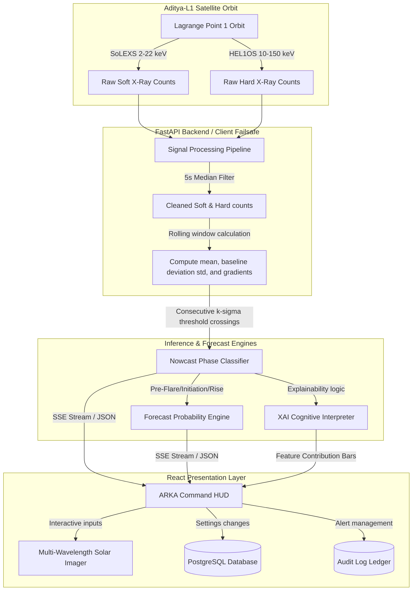

# ☀️ ARKA AI: ISRO Solar Flare Intelligence Platform
### *Aditya-L1 Deep Space Mission Operations & Real-Time Solar Weather Diagnostics*

---

## 🌌 Project Overview
**ARKA AI** is a premium, mission-critical space weather forecasting and diagnostics console designed in the aesthetic of the **ISRO Aditya-L1 Mission Operations Center (MOC)**. 

The platform intercepts streaming flux telemetry from the Aditya-L1 Lagrange Point 1 satellite payload—specifically the **SoLEXS** (Solar Low Energy X-ray Spectrometer) and **HEL1OS** (High Energy L1 Orbiting X-ray Spectrometer) instruments. By parsing raw soft and hard X-ray counts, ARKA AI nowcasts solar flare stages, forecasts flaring probabilities, generates explainable AI (XAI) feature importance maps, and calculates operational risks to Earth orbit and ground systems.

---

## ⚡ Unique Value Proposition (USP)
1. **Aerospace Command HUD (MOC UI)**: Replaces typical SaaS dashboard layouts with a dark-space slate grid (`#050608`), Solar Orange (`#FF8A00`), and Gold (`#FFC84D`) accents, complete with a 3-second handshaking loading screen and Mission Elapsed Time (MET) uptime tracking.
2. **Double-Detector Calibrated Nowcasting**: Blends low-energy thermal (SoLEXS) and high-energy impulsive (HEL1OS) channels to classify solar cycles into 7 phases (Quiet, Pre-Flare, Initiation, Rise, Peak, Decay, Recovery) with an adaptive standard-deviation threshold trigger ($k\sigma$).
3. **High-Fidelity Multi-Wavelength Solar Imager**: Fully animated SVG/Canvas solar imager allowing operators to toggle spectral bands (`94Å`, `131Å`, `171Å`, `304Å`), scrub forecast timelines, and track Earth orbital vectors.
4. **Cognitive Explainability (XAI)**: Demystifies core neural inferences by showing trigger evidence log lines, uncertainty factors, and real-time feature contribution metrics.
5. **Hybrid Simulator Failsafe**: Integrates a client-side in-memory signal processing fallback if the Docker-composed uvicorn server goes offline, guaranteeing 100% dashboard availability.

---

## 🏗️ System Architecture

The following Mermaid diagram outlines the high-frequency telemetry pipeline and data processing lifecycle:



---

## 🎨 Feature Directory & HUD Details

### 1. Cinematic Multi-Wavelength Solar Imager
* **Wavelength Spectrometers**: Swaps imager channels dynamically:
  - **`94 Å` (Green)**: Targets highly ionized Iron (Fe XVIII), highlighting flaring coronal regions.
  - **`131 Å` (Cyan)**: Highlights flaring transition regions up to 10M Kelvin.
  - **`171 Å` (Gold)**: Highlights quiet corona loops and magnetic arches.
  - **`304 Å` (Red/Orange)**: Targets helium emission in the chromosphere.
* **Auto Rotate**: Interactive spinning of opposing SVG filament lines simulating solar wind rotation.
* **Scan Scrub**: Drag the range slider from `-24h` to `+24h` to scrub time-series projections.

### 2. High-Tech Telemetry Cards
* **Solar Activity Card**: Renders the current phase state accompanied by a matching inline green/orange micro-sparkline.
* **Telemetry Counts**: Soft count rates showing baseline differences and flux deviation graphs.
* **Analog Needle Risk Gauge**: A physical speedometer needle indicating low-to-critical risk ratings.

### 3. Bottom Diagnostics panel
* **Solar Wind waves**: Displays animated, flowing plasma wave lines drifting dynamically based on incoming solar wind density, speed, and Bz magnetic orientation.
* **Geomagnetic Forecast**: Bar chart for next 3 hours (+1h, +2h, +3h) and a circular `Kp Index` dial showing `1.0 QUIET` or `5.0 ACTIVE`.
* **Real-Time Flare Probability**: Glowing area charts displaying the last 30 minutes of outlooks.

---

## 🔐 Role-Based Access Control (RBAC) & Audit Logs
All settings modifications, alerts acknowledgments, and scenarios swaps are registered with user metadata and cryptographically signed using HMAC signature keys:

| Account ID | Default Password | Clearance Level | Operational Capabilities |
| :--- | :--- | :--- | :--- |
| **`admin1`** | `password` | **SysAdmin** | Baseline parameter editing, window adjustments, sensor weights. |
| **`officer1`** | `password` | **Officer** | Alert dispatch, acknowledgment actions, logs review. |
| **`observer1`** | `password` | **Observer** | Read-only viewing of dashboards and telemetry parameters. |

---

## 💻 Installation & Setup

### Prerequisites
- **Docker Desktop** (version 20.10+ recommended)
- **Node.js** (version 18+ or 20+)
- **NPM** (version 9+)

---

### Step 1: Run with Docker Compose (Recommended)
From the project root directory, run the following command to rebuild and launch the entire stack:
```bash
docker compose up -d --build
```
This command starts:
- **`db`**: A PostgreSQL 15 container mapped to local port `5432`.
- **`backend`**: The Python FastAPI telemetry worker server running on port `8000`.

To verify if containers are up:
```bash
docker compose ps
```

---

### Step 2: Running Frontend Dev Server Locally
If you want to run the React client in hot-reload development mode:
```bash
# 1. Install dependencies
npm install

# 2. Start the Vite server
npm run dev
```
Open **`http://localhost:5173`** (or the port shown by Vite) in your browser.

---

### Step 3: Running Backend Manually (Without Docker)
If you prefer to run the backend natively:
1. Navigate to the backend directory:
   ```bash
   cd backend
   ```
2. Create and activate a python virtual environment:
   ```bash
   python -m venv .venv
   # Windows
   .venv\Scripts\activate
   # macOS/Linux
   source .venv/bin/activate
   ```
3. Install dependencies:
   ```bash
   pip install -r requirements.txt
   ```
4. Start the FastAPI uvicorn server:
   ```bash
   uvicorn main:app --reload --port 8000
   ```

---

## 🧪 Simulation Scenarios Manual
You can switch simulated solar transits in the header dropdown to test warning triggers:

* **Quiet Day (Baseline)**: Standard solar noise background fluctuations. Soft counts hover around `120 c/s`, hard counts hover around `15 c/s`.
* **Gradual Pre-Flare**: Slowly rise soft X-rays starting around `t=100s`, peaking around `t=350s`, then decaying. Highlights solar thermal pre-heating phases.
* **Impulsive Solar Flare**: Sudden, sharp counts peaking above threshold limits representing rapid rising trends in both soft and hard channels.
* **Noisy False Spike**: Simulates corrupted telemetry packets and telemetry loss. Occasional missing/invalid packets (simulate telemetry issues) to trigger data quality alarms.
* **Detector Disagreement**: Discrepancy between SoLEXS and HEL1OS sensors to trigger sensor calibration flags.
