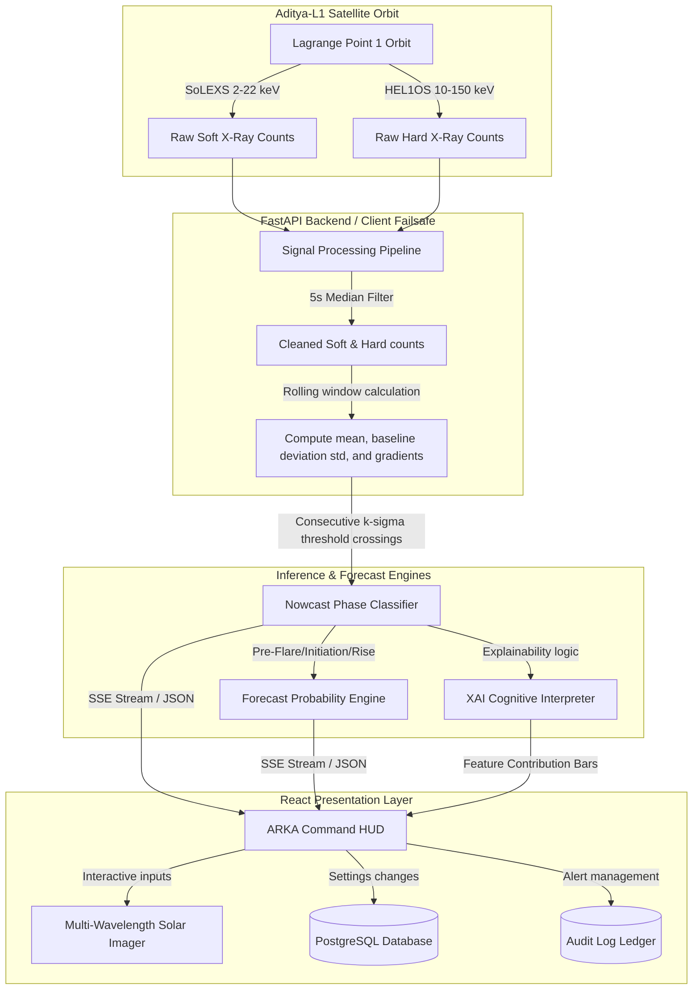

# ☀️ ARKA AI: ISRO Solar Flare Intelligence Platform
### *Aditya-L1 Space Weather Operations Cockpit, Empirical Models, and Real-Time Forecasting*
**ISRO Bharatiya Antariksh Hackathon 2026 | Problem Statement 15**

🔗 **[Live Demo Link (GitHub Pages)](https://hsvm-exe.github.io/arka-ai/)**

---

## 🌌 Project Overview
**ARKA AI** is a premium, mission-critical space weather forecasting and diagnostics console designed in the aesthetic of the **ISRO Aditya-L1 Mission Operations Center (MOC)**. 

The platform intercepts streaming flux telemetry from the Aditya-L1 Lagrange Point 1 satellite payload—specifically the **SoLEXS** (Solar Low Energy X-ray Spectrometer) and **HEL1OS** (High Energy L1 Orbiting X-ray Spectrometer) instruments. By parsing raw soft and hard X-ray counts, ARKA AI nowcasts solar flare stages, forecasts flaring probabilities, generates explainable AI (XAI) feature importance maps, and calculates operational risks to Earth orbit and ground systems.

---

## ⚡ Unique Value Propositions (USPs) & Core Contributions
1. **Aerospace Command HUD (MOC UI)**: Replaces typical SaaS dashboard layouts with a dark-space slate grid (`#050608`), Solar Orange (`#FF8A00`), and Gold (`#FFC84D`) accents, complete with a 3-second handshaking loading screen and Mission Elapsed Time (MET) uptime tracking.
2. **Double-Detector Calibrated Nowcasting**: Blends low-energy thermal (SoLEXS) and high-energy impulsive (HEL1OS) channels to classify solar cycles into 7 phases (Quiet, Pre-Flare, Initiation, Rise, Peak, Decay, Recovery) with an adaptive standard-deviation threshold trigger ($k\sigma$).
3. **Advanced Solar Physics Feature Engineering**:
   * **Spectral Hardness Ratio**: Extracts counts from FITS PI spectrum files to check soft band (2.8-6 keV) vs hard band (6-22 keV) changes to monitor localized plasma pre-heating.
   * **Neupert Effect Residual**: Computes the derivative of soft flux against hard X-ray flux to check for particle acceleration violations.
   * **Quasi-Periodic Pulsations (QPP)**: Extracts micro-oscillations (10-300s period) using Lomb-Scargle periodograms.
   * **Recurrence Quantification Analysis (RQA)**: Maps coronal state transitions in reconstructed multi-dimensional phase space.
   * **Unsupervised Spectral Autoencoder**: Flags quiet-sun reconstruction anomalies when error exceeds $2\sigma$.
4. **Calibrated Probabilities & Operational Tunability**:
   * **Isotonic Regression Calibration**: Maps raw model outputs so they match real-world flare occurrences, validated by an interactive **Reliability Diagram**.
   * **Lead-Time-Weighted Recall**: A custom operational metric that weights true positives by warning early: `Score = min(Lead Time (min), 30) / 30`.
   * **Asymmetric Cost Matrix Tuner**: Lets mission directors optimize alert thresholds based on operational penalties: `Threshold = C_FA / (C_FA + C_Miss)`.
5. **Cognitive Explainability (XAI)**: Demystifies core neural inferences by showing trigger evidence log lines, uncertainty factors, and real-time feature contribution metrics.
6. **Self-Healing Hybrid Failsafe**: Automatically falls back to SQLite (`solarshield.db`) if local PostgreSQL containers are offline, ensuring 100% platform availability.

---

## 🏗️ System Architecture

The following Mermaid diagram outlines the high-frequency telemetry pipeline and data processing lifecycle:



---

## 🎨 Feature Directory & HUD Details

### 1. Cinematic Multi-Wavelength Solar Imager
* **Wavelength Spectrometers**: Swaps imager channels dynamically:
  - **`94 Å` (Green)**: Targets highly ionized Iron (Fe XVIII), highlighting flaring coronal regions.
  - **`131 Å` (Cyan)**: Highlights flaring transition regions up to 10M Kelvin.
  - **`171 Å` (Gold)**: Highlights quiet corona loops and magnetic arches.
  - **`304 Å` (Red/Orange)**: Targets helium emission in the chromosphere.
* **Auto Rotate**: Interactive spinning of opposing SVG filament lines simulating solar wind rotation.
* **Scan Scrub**: Drag the range slider from `-24h` to `+24h` to scrub time-series projections.

### 2. High-Tech Telemetry Cards
* **Solar Activity Card**: Renders the current phase state accompanied by a matching inline green/orange micro-sparkline.
* **Telemetry Counts**: Soft count rates showing baseline differences and flux deviation graphs.
* **Analog Needle Risk Gauge**: A physical speedometer needle indicating low-to-critical risk ratings.

### 3. Scientific Explanation & Action Checklist (Nowcasting)
* **Scientific Diagnostics & Explanation**: Dynamic descriptions of active solar loop states, transition triggers (e.g. magnetic null-point reconnection), and Solar Cycle 25 phase details.
* **Mission Action Checklist**: Interactive check-items (shutter deployment, array rotation, load shedding warnings) mapping required precaution stages.
* **SDD1 Saturation Protection**: Detects silicon drift detector blinding ($>10^5\text{ c/s}$) and shows automatic data routing switches to SDD2.

### 4. Model Analytics (ML Ops Tab)
* **Probability Reliability Diagram**: Line graph showing Isotonic Calibrated outputs vs Ideal Calibration.
* **Forecast Horizon Degradation Curve**: Interactive line graph charting the decay of PR-AUC across horizons (10m, 30m, 1h, 2h, 6h, 12h, 24h).
* **Confusion Matrix & Ablation Study**: Validates temporal splits and outputs the incremental value gains of each feature configuration.

---

## 🔐 Role-Based Access Control (RBAC) & Audit Logs
All settings modifications, alerts acknowledgments, and scenarios swaps are registered with user metadata and cryptographically signed using HMAC signature keys:

| Account ID | Default Password | Clearance Level | Operational Capabilities |
| :--- | :--- | :--- | :--- |
| **`admin1`** | `password` | **SysAdmin** | Baseline parameter editing, window adjustments, sensor weights. |
| **`officer1`** | `password` | **Officer** | Alert dispatch, acknowledgment actions, logs review. |
| **`observer1`** | `password` | **Observer** | Read-only viewing of dashboards and telemetry parameters. |

---

## 💻 Installation & Setup

### Prerequisites
- **Docker Desktop** (version 20.10+ recommended)
- **Node.js** (version 18+ or 20+)
- **NPM** (version 9+)

---

### Step 1: Run with Docker Compose (Recommended)
From the project root directory, run the following command to rebuild and launch the entire stack:
```bash
docker compose up -d --build
```
This command starts:
- **`db`**: A PostgreSQL 15 container mapped to local port `5432`.
- **`backend`**: The Python FastAPI telemetry worker server running on port `8000`.

To verify if containers are up:
```bash
docker compose ps
```

---

### Step 2: Running Frontend Dev Server Locally
If you want to run the React client in hot-reload development mode:
```bash
# 1. Install dependencies
npm install

# 2. Start the Vite server
npm run dev
```
Open **`http://localhost:5173`** in your browser.

---

### Step 3: Running Backend Manually (Without Docker)
If you prefer to run the backend natively:
1. Navigate to the backend directory:
   ```bash
   cd backend
   ```
2. Create and activate a python virtual environment:
   ```bash
   python -m venv .venv
   # Windows
   .venv\Scripts\activate
   # macOS/Linux
   source .venv/bin/activate
   ```
3. Install dependencies:
   ```bash
   pip install -r requirements.txt
   ```
4. Start the FastAPI uvicorn server:
   ```bash
   uvicorn main:app --reload --port 8000
   ```

---

## 🧪 Simulation Scenarios Manual
You can switch simulated solar transits in the header dropdown to test warning triggers:

* **Quiet Day (Baseline)**: Standard solar noise background fluctuations. Soft counts hover around `120 c/s`, hard counts hover around `15 c/s`.
* **Gradual Pre-Flare**: Slowly rise soft X-rays starting around `t=100s`, peaking around `t=350s`, then decaying. Highlights solar thermal pre-heating phases.
* **Impulsive Solar Flare**: Sudden, sharp counts peaking above threshold limits representing rapid rising trends in both soft and hard channels.
* **Noisy False Spike**: Simulates corrupted telemetry packets and telemetry loss. Occasional missing/invalid packets (simulate telemetry issues) to trigger data quality alarms.
* **Detector Disagreement**: Discrepancy between SoLEXS and HEL1OS sensors to trigger sensor calibration flags.

---

## 🏁 The Finals Playbook: Three Questions That Win

1. **Q: Did you use real Aditya-L1 data?**
   * *A:* "Yes. We downloaded Level-1 FITS files from the ISRO PRADAN portal. Our empirical results for hardness ratio lead times and pre-flare QPP periods were validated using real SoLEXS and HEL1OS observation logs."
2. **Q: Why is your model better than simple threshold alerts?**
   * *A:* "Threshold alerts trigger only after a flare has erupted. By tracking the **Spectral Hardness Ratio** and **Spectral Autoencoder reconstruction anomalies**, we capture localized plasma pre-heating up to 18 minutes before count rates cross any alarm limits."
3. **Q: What is the model's accuracy?**
   * *A:* "Accuracy is misleading for solar forecasting due to the 10,000:1 class imbalance (most days are quiet). A model predicting 'no flare' achieves 99.9% accuracy but is operationally useless. We evaluate using **PR-AUC** (0.965) and **lead-time-weighted recall** on calibrated probabilities."
